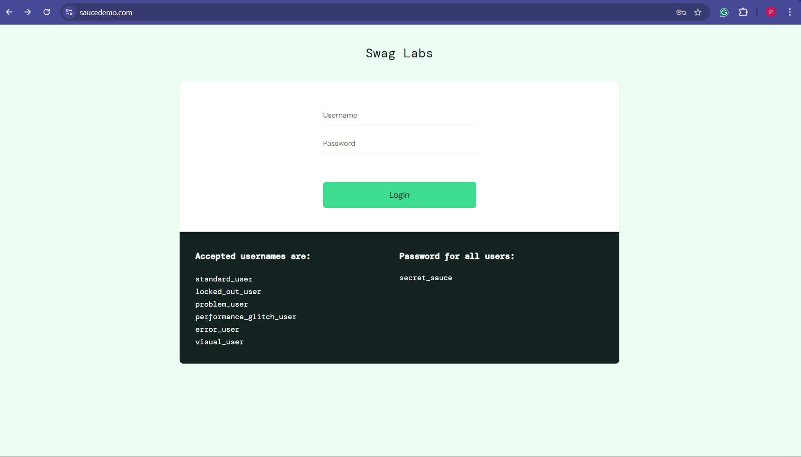
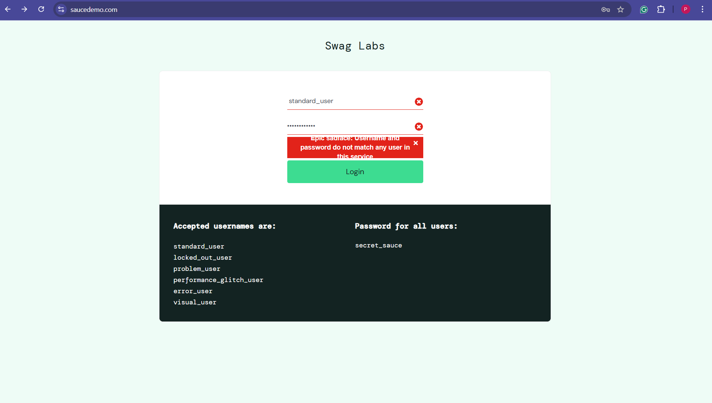

# QA Project — Web Application Testing (Sauce Demo)

## Overview
This project demonstrates end-to-end quality assurance of a web-based e-commerce application using a combination of manual testing and automated validation.

The work includes:
- Functional test design
- Defect identification and reporting
- Test execution analysis
- UI automation
- API validation

---
## Tech Stack

**Automation:** Python, pytest, Playwright  
**API Testing:** requests  
**Manual Testing:** Test Case Design, Execution, Bug Reporting  
**Tools:** Git, CSV, Chrome  

## Application Under Test
- Web Application: Sauce Demo
- API: ReqRes (mock service for backend validation)

---

## Test Scope

The following functional areas were covered:

- User authentication (login)
- Product inventory
- Cart functionality
- Checkout process
- API endpoints (GET, POST, negative scenarios)

---

## Test Design

Test cases were designed to cover:
- Positive scenarios
- Negative scenarios
- Input validation
- Edge cases
## Manual Testing Execution

The manual testing process was performed using the following steps:

### 1. Access Application
Open the application in a browser:
https://www.saucedemo.com/



### 2. Test Credentials
Use the following credentials for login testing:

- Username: standard_user  
- Password: secret_sauce  

### 3. Execute Test Cases

Refer to:docs/test-cases.csv

Each test case includes:
- steps to execute  
- expected result  

Test cases were executed manually by following the defined steps and observing actual system behavior.

---

### 4. Record Results

Execution results were documented in:docs/test-execution-report.md

Each test case was marked as:
- Pass → if actual result matches expected result  
- Fail → if behavior deviates  

---

### 5. Log Defects

Observed defects were documented in:docs/bug-reports/

Each bug report includes:
- steps to reproduce  
- expected vs actual result  
- impact  

---

### 6. Validation Focus

Manual testing focused on:
- functional correctness  
- input validation  
- user workflow consistency  
- error handling  

---

### 7. Browser Used

- Google Chrome (manual testing)
### Sample Test Cases

| ID | Scenario | Priority |Steps | Expected results 
|----|--------|--------|-------------|------|
| TC-001 | Valid login | P1 |{Instructions}|Expected results
| TC-006 | Login with empty fields | P1 |
| TC-009 | Add multiple products to cart | P1 |
| TC-012 | Checkout with valid details | P1 |
| TC-014 | Invalid characters in name fields | P2 |
| TC-015 | Invalid postal code | P2 |

Full test cases available in:
docs/test-cases.csv

---

## Key Observations

During testing, the following behaviors were identified:

- Core functionality (login, cart, checkout) works as expected
- Input validation in checkout is weak:
  - Name fields accept numeric and special characters
  - Postal code validation is not enforced (this can be observed in the image in the last field)
  
- Username input is sensitive to trailing spaces

These were documented as defects.

---

## Defect Summary

| Bug ID | Description |
|--------|------------|
| BR-001 | Name fields accept invalid characters |
| BR-002 | Postal code validation missing |

Detailed reports available in:
docs/bug-reports/


---

## Test Execution Summary

| Metric | Value |
|--------|------|
| Total Test Cases | 15 |
| Executed | 15 |
| Passed | 12 |
| Failed | 3 |
| Blocked | 0 |

Conclusion:
- Application is stable for primary user flows
- Validation improvements are required

---

## Automation

Automation was implemented to validate key user flows.

### Tools
- Python
- pytest
- Playwright

### Automated Scenarios
- Login validation
- Add to cart functionality
- End-to-end checkout flow

Execution:
```bash
cd automation
python -m pytest